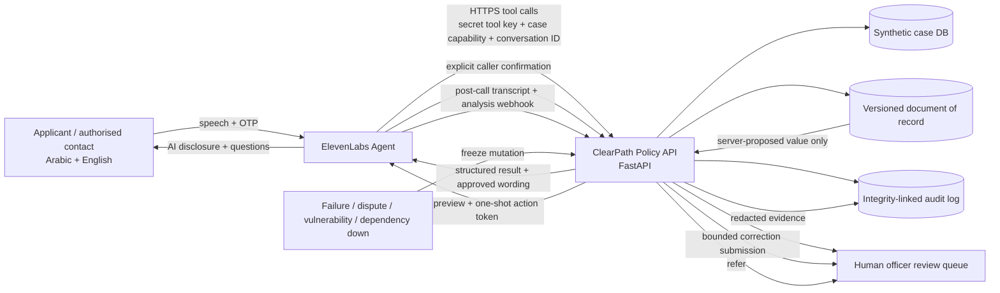

# ClearPath Voice — Stage 2 Architecture

> **Safety invariant:** The LLM converses; the backend owns authority.

## Trust boundaries

1. **Voice is untrusted input.** Caller speech may explain or dispute a value, but cannot become the writable source of truth for sensitive identity data.
2. **ElevenLabs is the conversation layer.** The agent can invoke only scoped server tools.
3. **ClearPath is the authority layer.** Case identity is derived from a short-lived capability bound to the ElevenLabs conversation ID.
4. **High-stakes mutations are two phase.** Verified session → backend preview from the document of record → explicit confirmation → one-shot commit token.
5. **The human approval gate remains outside the model.** A successful commit means `CORRECTION_SUBMITTED`, not application approval.
6. **Post-call evidence is signed and redacted.** The webhook verifies the ElevenLabs HMAC signature, redacts OTP/phone patterns, and stores evidence idempotently.

## Dependency-down behaviour

No privileged write is attempted when verification fails, the case is disputed, the authoritative document is stale or corrupted, or required infrastructure is unavailable. The safe outcome is defer, freeze, or refer to a qualified human.
